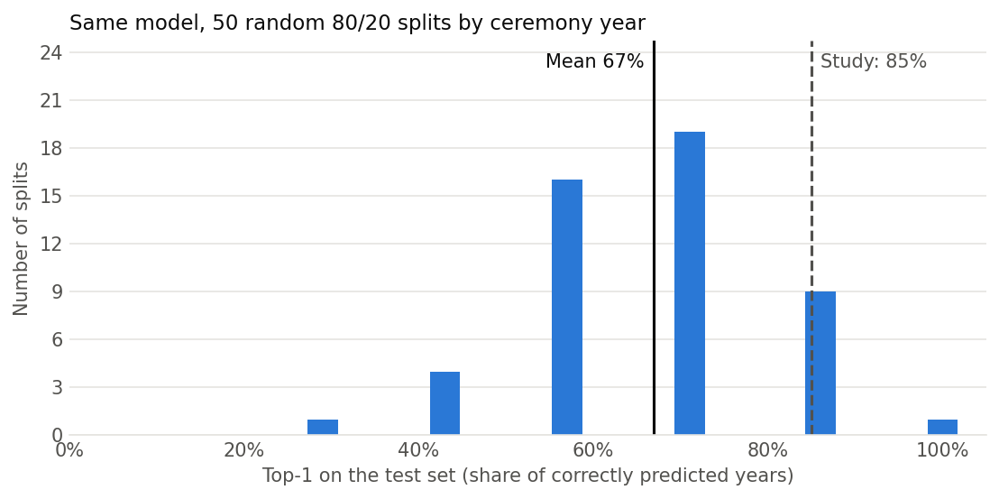
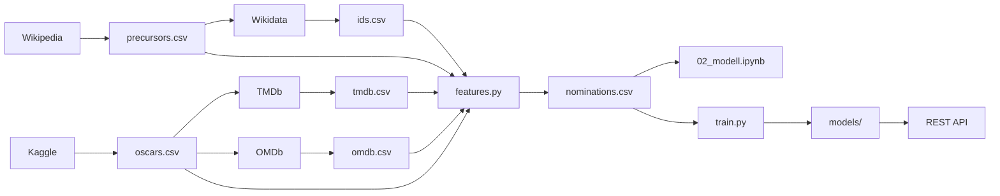

# Oscar Predictor: Best Picture

Predicting the Academy Award for **Best Picture** from guild awards and Oscar nominations, and checking how much of the accuracy reported in the literature survives an honest evaluation.

**Short answer:** About two thirds. A logistic regression on guild awards picks the right winner in 8 of the 12 ceremonies from 2015 to 2026. The simple rule "the PGA winner wins" gets 9 of 12. A recent study reports 85 % for the same task. With its features and its evaluation protocol this project reproduces that number (86 %), but repeating the protocol over 50 random splits shows it is one lucky split: the average is 67 %.



## Key results

All numbers count **ceremonies where the predicted winner was correct** (top-1 accuracy). Every split keeps whole ceremonies together, so nominees of the same year never end up in both training and test data. Data: ceremonies 1996–2026 (films from 1995 on), 226 nominations, 31 winners.

| Evaluation | Features | Correct | Top-1 |
| --- | --- | --- | --- |
| Walk-forward 2015–2026 (train only on earlier years) | PGA + DGA + SAG (selected model) | 8 / 12 | 67 % |
| Walk-forward 2015–2026 | Study features | 8 / 12 | 67 % |
| Rule: PGA winner wins | – | 9 / 12 | 75 % |
| Rule: most Oscar nominations wins | – | 4 / 12 | 33 % |
| Study protocol: one random 80/20 split (seed 42) | Study features | 6 / 7 | 86 % |
| Study protocol repeated with 50 random seeds | Study features | mean 67 % | range 29–100 % |
| Grouped 5-fold cross-validation | Study features | 20 / 31 | 65 % |

"Study features" re-creates the Best Picture features of Butcher & Abbass (2026) with this project's columns: DGA and PGA winner, total Oscar nominations, Director and Film Editing nomination, Drama genre, Golden Globe winner.

## Findings

**1. Guild awards carry almost all the signal.** Three guild awards (PGA, DGA, SAG ensemble) are enough. Adding critics' scores, genres, runtime and the rest does not help; using all 32 numeric features makes predictions worse (5 instead of 8 correct ceremonies on the 2005–2014 development years).

**2. The best indicator changed around 2010.** Since the 2010 ceremony, Best Picture is decided by a preferential ballot, the same system the Producers Guild uses.

| Precursor winner also won Best Picture | until 2009 | from 2010 |
| --- | --- | --- |
| PGA | 8 / 14 (57 %) | 14 / 17 (82 %) |
| DGA | 10 / 14 (71 %) | 11 / 17 (65 %) |
| SAG ensemble | 7 / 14 (50 %) | 8 / 17 (47 %) |
| BAFTA (from 2001) | 3 / 9 (33 %) | 8 / 17 (47 %) |
| Critics' Choice | 8 / 14 (57 %) | 11 / 17 (65 %) |

The model learns from all years, so it still trusts the DGA more than recent years justify. The one ceremony where model and PGA rule differ in outcome is 2019: the model followed the DGA to *Roma*, the PGA correctly pointed to *Green Book*.

**3. A single random split is not a result.** With roughly 6–7 test ceremonies per 80/20 split, one ceremony moves the score by about 15 points. Across 50 random splits the same model scores anywhere between 29 % and 100 %, and one split in five reaches 85 % or more. Walk-forward (67 %), grouped 5-fold (65 %) and the 50-split mean (67 %) agree: the realistic accuracy is about two thirds.

**4. Real upsets stay unpredictable.** *Spotlight* (2016), *Moonlight* (2017) and *Parasite* (2020) are missed by the model and the PGA rule alike.

**Why not plain accuracy?** Each ceremony has one winner and four to nine losers. Predicting "loses" for every film already scores 86–89 % row-level accuracy, so a high accuracy says almost nothing. With exactly one pick and one winner per ceremony, precision, recall and F1 all equal the top-1 accuracy.

## Data sources

| Source | Used for | Access |
| --- | --- | --- |
| [Kaggle: The Oscar Award, 1927–2026](https://www.kaggle.com/datasets/unanimad/the-oscar-award) (`full_data.csv`, based on [DLu/oscar_data](https://github.com/DLu/oscar_data)) | All nominations and winners with IMDb IDs | `kagglehub` |
| Wikipedia award pages | PGA, DGA, SAG ensemble, BAFTA, Golden Globes (Drama and Musical/Comedy), Critics' Choice: nominees and winners per year | HTML scraping, winners detected by cell highlighting |
| [Wikidata](https://www.wikidata.org) | Wikipedia article → IMDb ID, to join precursors with the Oscars | MediaWiki and Wikidata APIs |
| [TMDb](https://www.themoviedb.org) | Genres, runtime, language, US release date, budget | TMDb API (free key) |
| [OMDb](https://www.omdbapi.com) | Metascore, Rotten Tomatoes, IMDb rating and votes | OMDb API (free key, 1,000 requests per day) |

This product uses the TMDb API but is not endorsed or certified by TMDb. OMDb and IMDb data may only be used non-commercially. Raw data is not part of the repository; `run_pipeline.py` rebuilds it.

## Pipeline



Every source class caches its raw responses in `data/raw/`, so a second run makes no requests. `features.py` joins everything on the IMDb ID and writes one row per nomination with the target `won`.

**Leakage rules built into the features**

- Only nominations at the same ceremony count as features, never wins in other categories (those are decided on the same night).
- BAFTA results before the 2001 ceremony are left empty, because BAFTA used to take place after the Oscars.
- Precursor awards that did not exist yet in a given year are empty, not 0.
- Known limitation: IMDb votes and box office are today's values and include the boost after an Oscar win. They are not part of the selected model.

## Model and evaluation

- **Model:** logistic regression (scikit-learn) with median imputation and standardisation. Each nominee gets a probability; per ceremony the highest probability is the pick.
- **Model selection** happened only on the development years 2005–2014 (walk-forward). Five feature sets with and without extra weight on recent years were compared; PGA + DGA + SAG without weighting won with 8 of 10 (PGA rule: 7 of 10). The test years 2015–2026 were not used for any decision.
- **Walk-forward:** every test year is predicted by a model trained only on earlier years, the way a forecast before a real ceremony works.
- **Grouped splits:** `GroupShuffleSplit` and `GroupKFold` with the ceremony year as group, as in the study.
- **Serving:** `train.py` retrains the selected model on all ceremonies and saves it to `models/`. A small FastAPI app serves it; see the [API README](src/oscar/api/README.md).

## Project structure

```
oscar-predictor/
├── run_pipeline.py          # builds data/processed/nominations.csv
├── src/oscar/
│   ├── sources/             # kaggle.py, wikipedia.py, wikidata.py, tmdb.py, omdb.py
│   ├── features.py          # joins sources, builds features, leakage rules
│   ├── model.py             # splits, metrics, baselines, plots
│   ├── train.py             # trains the final model and saves it to models/
│   └── api/                 # REST API, see src/oscar/api/README.md
├── notebooks/
│   ├── 01_eda.ipynb         # data exploration
│   └── 02_modell.ipynb      # model selection and evaluation
├── models/                  # trained model and its metadata
├── reports/figures/         # figures used in this README
└── data/                    # raw, interim and processed data (not in git)
```

## Running it

Requires [uv](https://docs.astral.sh/uv/).

```bash
uv sync                                   # Python and dependencies from pyproject.toml
cp .env.example .env                      # then add your keys, see below
uv run python run_pipeline.py             # downloads and builds the dataset
```

`.env` needs `TMDB_API_KEY` (TMDb API read access token) and `OMDb_API_KEY`. Kaggle may ask for a login on first download (`kagglehub.login()`). Then open `notebooks/02_modell.ipynb` with the project's `.venv` kernel and run all cells.

To serve the model as a REST API:

```bash
uv run python -m oscar.train                  # trains the model and saves it to models/
uv run uvicorn oscar.api.main:app --reload    # then open http://127.0.0.1:8000/docs
```

Endpoints, example requests and how the API works are described in the [API README](src/oscar/api/README.md).

The grouped 5-fold numbers can differ by one ceremony between scikit-learn versions, because the assignment of years to folds can change.

## Limitations

- Small sample: 31 ceremonies, 31 winners. Differences of one ceremony are within noise.
- The PGA tie before the 2014 ceremony (*12 Years a Slave* and *Gravity*) is recorded with one winner only; *Gravity* is missing.
- Winners on Wikipedia are detected by cell colour; a layout change on those pages would break the parser (the pipeline warns when a year has no winner).
- Only Best Picture. The pipeline collects all categories, but the other categories have different precursors.

## References

- Butcher, S. & Abbass, J. (2026). *A Machine Learning Approach to Predicting the Oscars.* IEEE Madhya Pradesh Section Conference (MPCON). doi:10.1109/MPCON69668.2026.11508236
- Pardoe, I. & Simonton, D. K. (2008). Applying discrete choice models to predict Academy Award winners. *Journal of the Royal Statistical Society A*, 171(2), 375–394.
- Kaplan, D. (2006). And the Oscar Goes to … A Logistic Regression Model for Predicting Academy Award Results. *Journal of Applied Economics and Policy*, 25(1).
- Afonso, P. N. B. (2018). *The Big Four: discrete choice modelling to predict the four major Oscar categories.* Master's thesis, NOVA School of Business and Economics.
