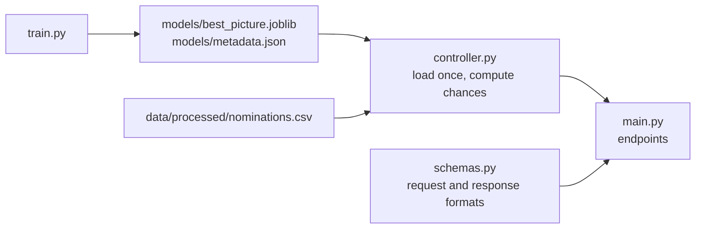

# Oscar Predictor API

A small REST API built with [FastAPI](https://fastapi.tiangolo.com) that serves the Best Picture model of this project. It returns each nominee's chance of winning and the model's pick.

## Quick start

Run all commands from the project root.

```bash
uv sync                                       # install dependencies (once)
uv run python -m oscar.train                  # train and save the model (once, and after new data)
uv run uvicorn oscar.api.main:app --reload    # start the API
```

Then open **http://127.0.0.1:8000/docs**. FastAPI generates an interactive page there where every endpoint can be tried in the browser.

What each endpoint needs:

| Endpoint | Needs |
| --- | --- |
| `GET /model` | the trained model in `models/` |
| `POST /predict` | the trained model in `models/` |
| `GET /prediction/{year}` | the trained model and `data/processed/nominations.csv` (built by `uv run python run_pipeline.py`) |

## How it works



**The model.** A logistic regression on three yes/no features: did the film win the PGA, the DGA and the SAG ensemble award? This feature set was chosen in `notebooks/02_modell.ipynb` on the ceremonies 2005–2014. On the untouched test ceremonies 2015–2026 it picked the right winner 8 times out of 12 (the rule "the PGA winner wins" got 9 out of 12). `train.py` then retrains it on all ceremonies from 1996 to 2026 and saves it.

**From probabilities to a pick.** The model rates every film on its own and returns a probability of winning. Because exactly one film wins per ceremony, the API divides these probabilities by their sum, so the chances of all films in a request add up to 1. The film with the highest chance is the pick.

**No pick without information.** If all films have the same guild awards, for example before the awards are announced, the model cannot tell them apart. The API then returns equal chances, no pick and a `warning`.

**Loading.** The model and the data are loaded on the first request and kept in memory (`lru_cache` in `controller.py`). After retraining the model, restart the server: `--reload` only reacts to code changes.

| File | Role |
| --- | --- |
| `main.py` | the FastAPI app and the three endpoints |
| `controller.py` | loads model and data once, computes the normalized chances, detects "no information" |
| `schemas.py` | Pydantic models that define and validate requests and responses |

## Endpoints

### `GET /model`

Which model is running: features, standardized coefficients, training years, library versions and the honest test result. This is the content of `models/metadata.json`.

```bash
curl http://127.0.0.1:8000/model
```

```json
{
  "feature_set": "PGA+DGA+SAG",
  "features": ["pga_win", "dga_win", "sag_win"],
  "coefficients_standardized": {"pga_win": 0.786, "dga_win": 0.765, "sag_win": 0.684},
  "train_ceremonies": [1996, 2026],
  "evaluation": {"method": "walk-forward 2015-2026", "ceremonies": 12, "model_hits": 8, "pga_rule_hits": 9},
  "...": "..."
}
```

### `GET /prediction/{year}`

Chances for the nominees of one ceremony from the dataset. `year` is the year of the ceremony, so `2017` means the ceremony in early 2017 for the films of 2016.

```bash
curl http://127.0.0.1:8000/prediction/2017
```

```json
{
  "year": 2017,
  "pick": "La La Land",
  "winner": "Moonlight",
  "correct": false,
  "in_training": true,
  "predictions": [
    {"title": "La La Land", "probability": 0.663, "pick": true, "imdb_id": "tt3783958", "won": false,
     "features": {"pga_winner": true, "dga_winner": true, "sag_winner": false}},
    {"title": "Hidden Figures", "probability": 0.161, "pick": false, "imdb_id": "tt4846340", "won": false,
     "features": {"pga_winner": false, "dga_winner": false, "sag_winner": true}},
    {"title": "Moonlight", "probability": 0.025, "pick": false, "imdb_id": "tt4975722", "won": true,
     "features": {"pga_winner": false, "dga_winner": false, "sag_winner": false}}
  ],
  "warning": null
}
```

The response is shortened to three of the nine nominees. `predictions` is sorted by probability.

`in_training: true` means the model saw this ceremony during training, so the pick is not an honest test. For honest numbers, see the walk-forward evaluation in the notebook. For a future ceremony whose nominations are already in the data, `winner`, `correct` and `won` are `null`.

### `POST /predict`

Chances for any list of films, for example the nominees of the next ceremony once the guild awards are known. Awards that are left out count as `false`. The list must contain 2 to 10 films.

```bash
curl -X POST http://127.0.0.1:8000/predict \
  -H "Content-Type: application/json" \
  -d '{"movies": [
        {"title": "Film A", "features": {"pga_winner": true}},
        {"title": "Film B", "features": {"dga_winner": true, "sag_winner": true}},
        {"title": "Film C", "features": {}}
      ]}'
```

```json
{
  "predictions": [
    {"title": "Film B", "probability": 0.731, "pick": true},
    {"title": "Film A", "probability": 0.239, "pick": false},
    {"title": "Film C", "probability": 0.03, "pick": false}
  ],
  "warning": null
}
```

## Errors

| Status | When |
| --- | --- |
| `404` | `/prediction/{year}` for a ceremony before 1996 or one that is not in the data |
| `422` | invalid request, e.g. fewer than 2 or more than 10 films, or a missing `title` |
| `503` | no trained model in `models/`, or no `nominations.csv` for `/prediction/{year}`; the message names the command to run |

## Limitations

- The model only knows PGA, DGA and SAG. Other signals such as BAFTA or critics' scores did not improve the predictions in the notebook.
- Until the guild awards are announced there is nothing to predict.
- When two films have exactly the same awards and the highest chance, the first one in the list becomes the pick.
- The probabilities come from 31 ceremonies. They show how the model ranks the films, not exact odds.
